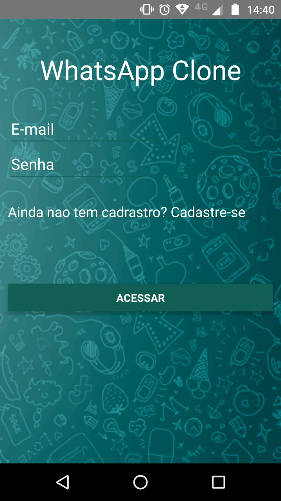
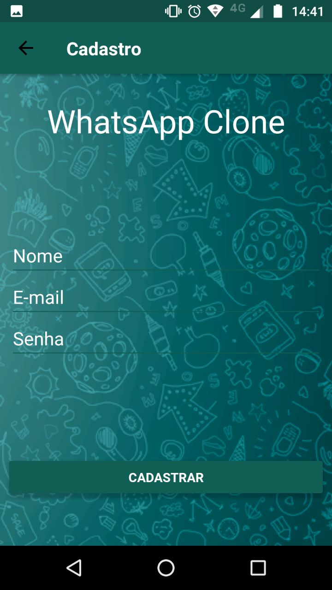
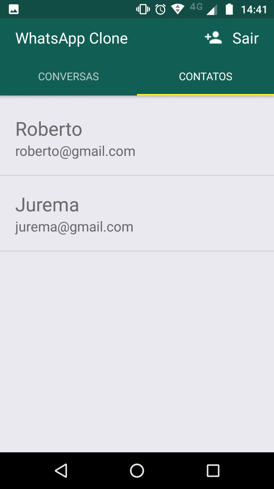
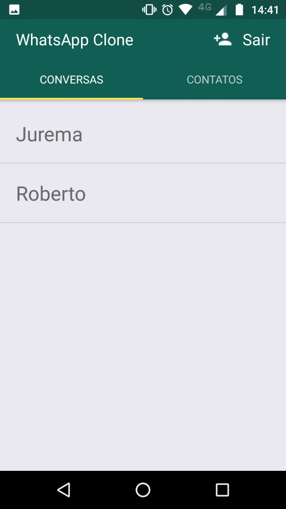
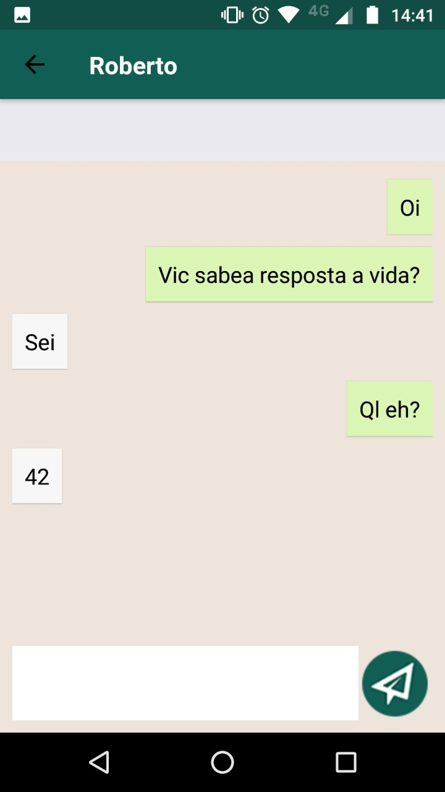
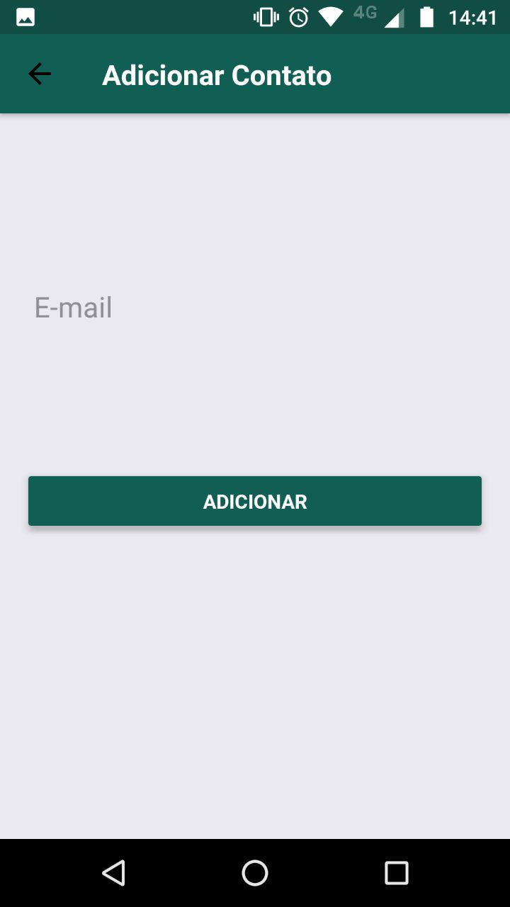

# WhatsClone

Um simples app feito em [React Native](https://facebook.github.io/react-native/) para consolidar os estudos sobre React Native.
  - [Firebase](https://www.npmjs.com/package/firebase) -> para autenticação e database 
  - [React native router flux](https://github.com/aksonov/react-native-router-flux) -> para fazer a navegação 
  - [React native tab view](https://github.com/react-native-community/react-native-tab-view) -> para criar uma tab view
  - [Redux](https://redux.js.org/) -> para gereciamento dos states e actions
  - [Redux thunk](https://github.com/reduxjs/redux-thunk) -> middleware para o Redux.
  
## Como executar o app

  - Instalar o [react native](https://facebook.github.io/react-native/docs/getting-started)
  - Clonar o Repositório
  - Instalar as Dependência
  - Criar um projeto no [firebase](https://firebase.google.com/?hl=pt-br) e configurar como um app web
  - Dentro do repositório executar, react-native run-android ou run-ios

## ScreenShots
<li>

</li>
